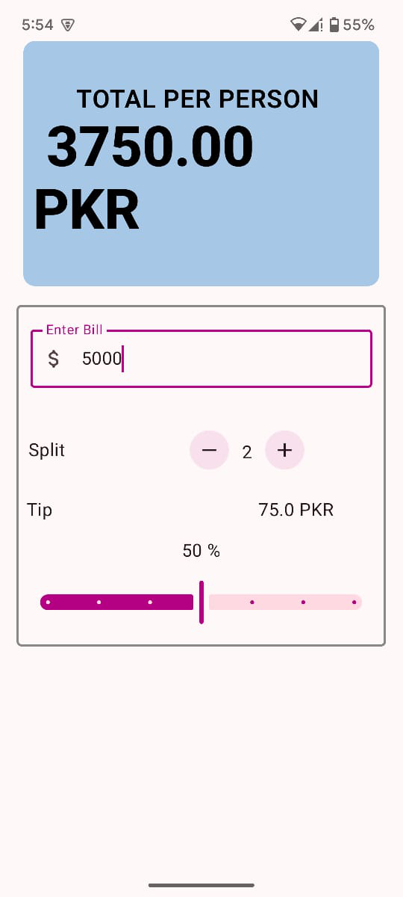
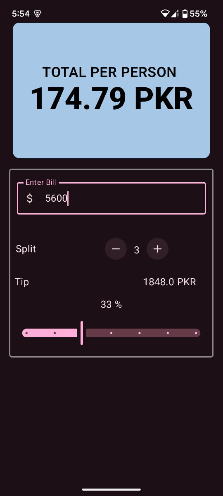

# 💰 Tip Calculator App (Jetpack Compose)

A modern **Tip Calculator** Android app built with **Jetpack Compose**. It allows users to:

- Enter the total bill amount.
- Choose a tip percentage.
- Split the tip per person using increment/decrement buttons.
- See the calculated **total tip** and **tip per person** in real-time.
- Enjoy a responsive and clean UI in both **light** and **dark** modes.

---

## 📱 Preview

| Light Mode | Dark Mode |
|------------|-----------|
|  |  |

---

## 🚀 Features

- 🎨 Beautiful and responsive Jetpack Compose UI
- 🔢 Real-time tip calculation
- ➕➖ Easily increase or decrease the number of people
- 🌗 Supports light and dark themes automatically

---

## 🛠️ Tech Stack

- **Kotlin**
- **Jetpack Compose**
- **State management with `remember` and `mutableStateOf`**
- **Material 3 Design**

---

## 🧑‍💻 How to Use

1. **Enter the total bill amount** in the input field.
2. Use the **"+" or "−" buttons** to increase/decrease the number of people to split the tip.
3. Adjust the **tip percentage** (optional).
4. The app will display:
   - Total Tip
   - Tip Per Person

---

